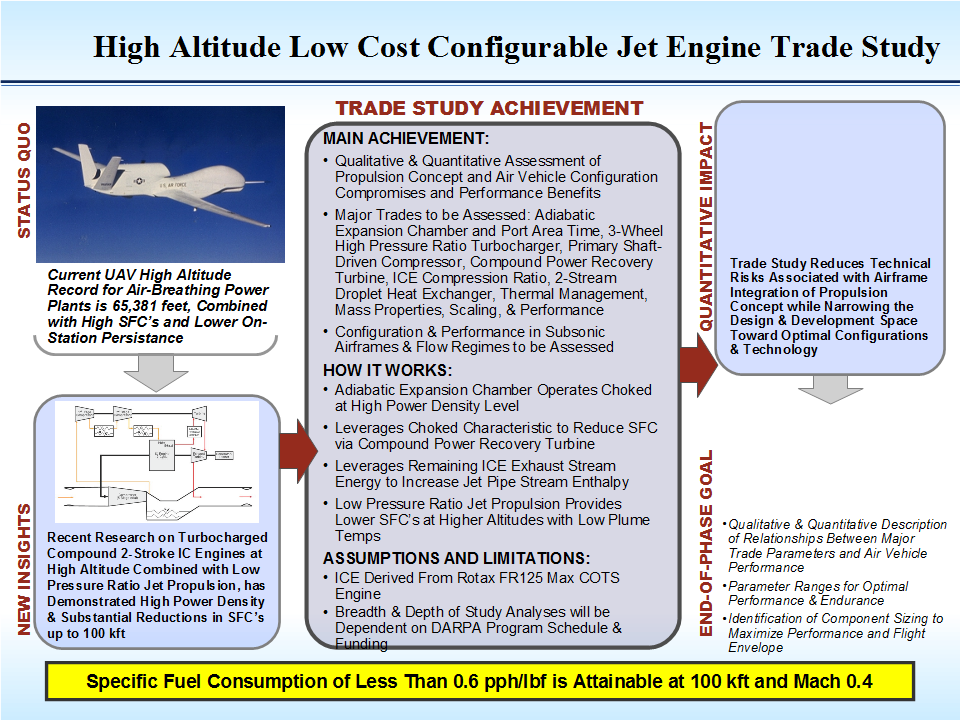

# ========================================
# Air Vehicle Double-Sided Shaft-Driven Compressor Design/Optimization for 0kft to 80kft Altitude Operation:
# ========================================

## I. Design Context Overview:

## 
## 
## II. Integraged Propulsion/Thermal System Schematic Diagram:

## 
## 
## III. Double-Sided Shaft-Driven Compressor Overview:

## 
## 
## IV. Major Features & Dimensions:

## 
## 
## V. 0 kft Altitude: Corrected Mass Flow Rate vs. Total Pressure Ratio & Efficiency:

## 
## 
## VI. 10 kft Altitude: Corrected Mass Flow Rate vs. Total Pressure Ratio & Efficiency:

## 
## 
## VII. 30 kft Altitude: Corrected Mass Flow Rate vs. Total Pressure Ratio & Efficiency:

## 
## 
## VIII. 50 kft Altitude: Corrected Mass Flow Rate vs. Total Pressure Ratio & Efficiency:

## 
## 
## IX. 80 kft Altitude: Corrected Mass Flow Rate vs. Total Pressure Ratio & Efficiency:

## 
## 
## X. 80 kft Altitude: Corrected Mass Flow Rate vs. Total Pressure Ratio & Efficiency @ High Pr:

## 
## *Note: Performance Data and Analysis performed using AxStream, SoftInWay Inc.